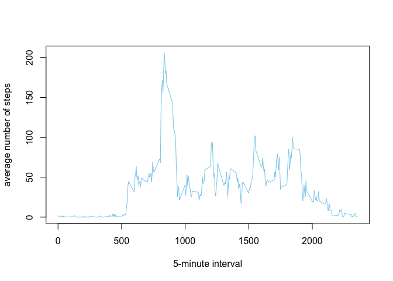
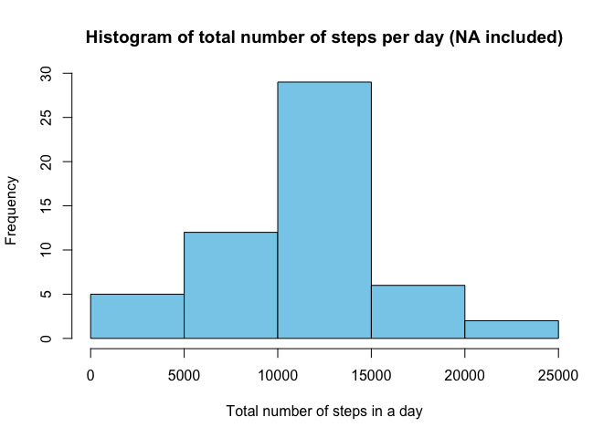
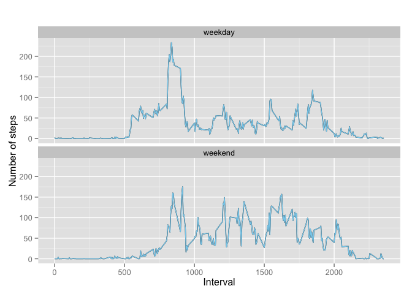

# Reproducible Research: Peer Assessment 1

## Loading and preprocessing the data
Load our initial library

```r
library(ggplot2)
library(stringr)
```

Loading original data

```r
unzip("activity.zip")
dat <- read.csv("activity.csv", colClasses = c("integer", "Date", "integer"))
```

remove noise so we can work with our data and also calculate the no.steps per day

```r
df <- na.omit(dat)
#remove rownames
rownames(df) <- NULL
#Aggregate steps as per date to get total number of steps in a day
date_steps_table <- aggregate(steps ~ date, df, sum)
```

Histogram will look like this

```r
#make histogram
hist(date_steps_table$steps, breaks = "Sturges",col = "skyblue",main="Histogram of total number of steps per day", xlab="Total number of steps in a day")
```

 


## What is mean total number of steps taken per day?

```r
#Calculate and report the mean and median total number of steps taken per day
mean(date_steps_table$steps)
```

```
## [1] 10766.19
```

```r
median(date_steps_table$steps)
```

```
## [1] 10765
```

## What is the average daily activity pattern?

To perform this analysis, we need to find mean per day of no.steps.

```r
# aggregate steps as per date to get total number of steps in a day
steps_avg_table <- aggregate(steps ~ interval, df, mean)
```

Then we plot the result

```r
#Create line plot of 5-minute interval 
plot(steps_avg_table,type="l", xlab= "5-minute interval", ylab= "average number of steps", col="skyblue")
```

 

To find maximum 5-minute interval steps. We need to find the id of row and then retrieve it. 


```r
#5-minutes interval contains maximum no.steps
max_row_id <- which.max(steps_avg_table$steps)
steps_avg_table[max_row_id,]
```

```
##     interval    steps
## 104      835 206.1698
```


## Imputing missing values

Inputting NA values requires more tasks to do. In specific, we first answer the question regarding the number of na rows:

```r
#Inputting missing values
df_na <- is.na(dat)
#number of na row.
length(dat[df_na])
```

```
## [1] 2304
```

In this assignment, I choose to replace NA value with the mean steps for corresponding 5-minute interval 


```r
#replace the NA by the mean for that 5-minute interval.
dat$steps[is.na(dat$steps)] <- steps_avg_table$steps[is.na(dat$steps)]
```

Similar to the previous plotting procedure, we plot a histogram including replaced na value to see the differences.

```r
# aggregate steps as per date to get total number of steps in a day
date_steps_table_na <- aggregate(steps ~ date, dat, sum)
```

And looking at the result


```r
#make histogram
hist(date_steps_table_na$steps, breaks = "Sturges",col = "skyblue",main="Histogram of total number of steps per day (NA included)", xlab="Total number of steps in a day")
```

 

We also recalculate new mean and median value of new set

```r
#Calculate and report the mean and median total number of steps taken per day
mean(date_steps_table_na$steps)
```

```
## [1] 10766.19
```

```r
median(date_steps_table_na$steps)
```

```
## [1] 10765.59
```

Conclusions:
Adding replaced NA value slightly increases the median value of new set. Overall, the graph indicates no significant differences in relation between steps and its occurence.


## Are there differences in activity patterns between weekdays and weekends?

To answer this question, we need to add additional variable called day_type. Variable day_type is a factor class and it hold 2 distinct values such as "weekend" or "weekday".


```r
#Convert to Class Date
dat$date <- as.Date(dat$date, "%Y-%m-%d")

#Add aditional column day to dat
dat$day <- weekdays(dat$date)

#Add aditional column called day type
dat$day_type <- c("weekday")

# If day is Saturday or Sunday, make day_type as weekend
for (i in 1:nrow(dat)){
  if (dat$day[i] == "Saturday" || dat$day[i] == "Sunday"){
    dat$day_type[i] <- "weekend"
  }
}
# Convert day_type to factor 
dat$day_type <-as.factor(dat$day_type)
```

We now perform calculation the mean of total no.steps in regard to interval and day_type.

```r
# aggregate steps as per date to get total number of steps in a day
date_steps_table <- aggregate(steps ~ interval + day_type, dat, mean)
```

and produce the result

```r
qplot(interval, steps, data=date_steps_table, geom=c("line"), xlab="Interval",
      ylab="Number of steps", main="")+facet_wrap(~ day_type, nrow=2, ncol=1) +geom_line(aes(group=1), colour="skyblue")
```

 

Conclusions:
Overall, the activity on weekends is more uniform distributed. In particular, he/she was active between 8:00 - 10:00 in the morning. On weekdays, similar pattern can be found: a lot of activity was recorded during the first hour of works ( 8:00 - 9:00 ). Probably, he/she has to go work.


